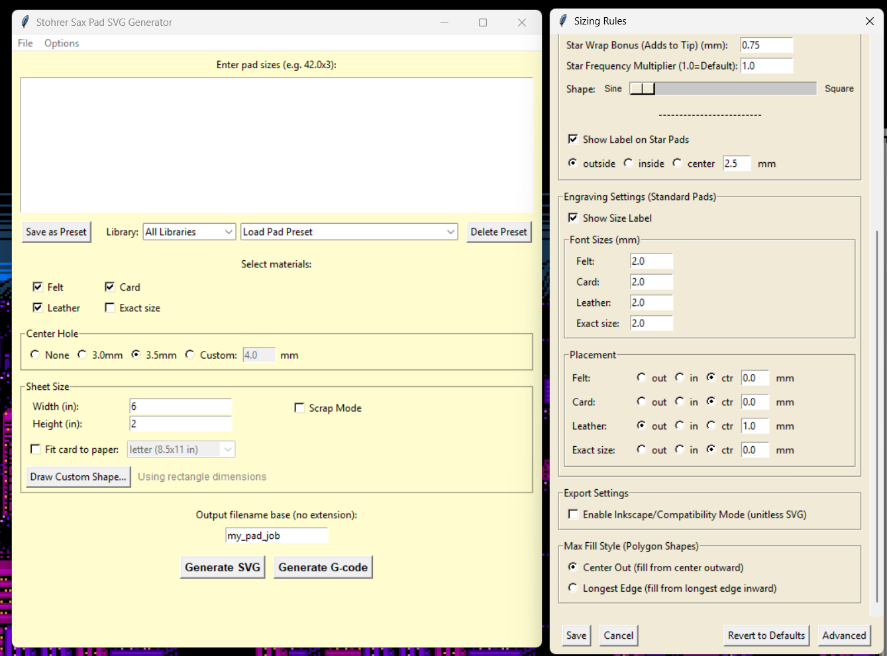

# Stohrer Sax Pad SVG Generator

## DEPRECATED - NO LONGER UPDATED

This app has been superseded by **[Stohrer Sax Shop Companion](https://github.com/stohrermusic/Stohrer-Sax-Shop-Companion)**, which includes improved and expanded SVG/G-code generation features plus key height databases, serial number lookup, and screw specifications. Please download the Companion instead.

---

A cross-platform desktop app for generating SVG and G-code files for laser-cutting saxophone pad materials (felt, card, leather).

## Features

### SVG & G-code Generation
- Generate cut patterns for **felt**, **card**, **leather**, and **exact size** pads
- **G-code output** for Grbl-based laser cutters (with per-material speed/power settings)
- Smart nesting algorithm to maximize material usage
- **Star/dart patterns** for small leather pads (configurable threshold)
- Configurable sizing rules, center holes, and engraving labels
- Per-material kerf compensation

### Custom Polygon Shapes
- Draw irregular shapes for leather skins and scrap pieces
- Grid-based shape definition (up to 8 points)
- Smart nesting: large pads go center, small pads fill edges/corners
- **Max fill mode**: use `18.0 x max` to fill remaining space with a pad size

### Scrap Mode
- Place pads across multiple irregularly-sized scrap pieces
- Enter all pad sizes, then cycle through scraps
- Tracks remaining pads across multiple output files
- Works with both SVG and G-code output

### Workflow Features
- Save and load pad presets organized by library
- Import/export presets for backup or sharing
- **Send G-code to SD Card** with auto-eject (Windows)
- Remembers last used settings and output directory

## Usage

Enter pad sizes in the format `size x quantity`, one per line:
```
34.0 x 10
28.5 x 5
22.0 x 8
```

Select your materials, set sheet dimensions, and click Generate SVG or Generate G-code.

**Note**: Use decimal points (not commas) for sizes. Values with commas will be ignored.

## Installation

### From Release (Recommended)
Download the latest release for your platform from the [Releases](https://github.com/stohrermusic/Stohrer-Sax-Pad-SVG-Generator/releases) page.

### From Source
```bash
pip install -r requirements.txt
python main.py
```

## Building

```bash
# Build for current platform
python build.py

# Clean and rebuild
python build.py --clean

# macOS: create .dmg
python build.py --dmg
```

## Config Location

Settings and presets are stored in platform-appropriate locations:
- **Windows**: `%APPDATA%\StohrerSaxPadSVGGenerator\`
- **macOS**: `~/Library/Application Support/StohrerSaxPadSVGGenerator/`
- **Linux**: `~/.config/StohrerSaxPadSVGGenerator/`

Existing config files from older versions (in the app folder) are automatically migrated on first run.

## Notes

- SVG output is optimized for LightBurn. Other apps may not display layers correctly.
- Default leather sizing assumes ~0.125" felt thickness. Adjust in Options if needed.
- Windows users may see an "unsigned program" warning on first run—this is normal.

## See Also

For additional features like key height databases, serial number lookup, and screw specifications, see [Stohrer Sax Shop Companion](https://github.com/stohrermusic/Stohrer-Sax-Shop-Companion).

---

Made for saxophone techs, by a saxophone tech.


